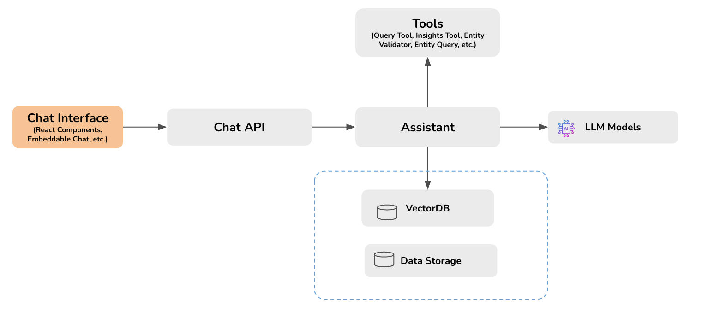

# Core Concepts & Architecture

At the heart of Opsloom are assistants that can utilize various techniques such as retrieval-augmented generation (RAG) and seamlessly connect to your organization's workflows. In the following diagram, you can see the architecture we've built around these assistants:

Read below for some of the concepts central to Opsloom.

## Core Concepts

### Assistants

Assistants are the core building blocks of Opsloom. They are the AI-powered agents that can be used to automate tasks, provide information, or interact with users. You can build your own custom assistants or use the pre-built ones provided by Opsloom.

### Large Language Models

A large language model (LLM) is a type of artificial intelligence that is trained on large datasets of text to understand, generate, and manipulate human language. In the context of assistants, LLMs act as the brain that enables the assistant to understand questions, interact intelligently with users, and perform actions on your behalf. The Opsloom assistants integrate with some of the most well-known LLMs, including OpenAI's GPT models (which provide the basis for ChatGPT), Meta's LLaMa, and Anthropic's Claude.

### Knowledge Base

A knowledge base is a repository of documents used to provide context for an assistant. During retrieval-augmented generation (RAG), these knowledge bases are treated as the authoritative source of truth. Documents in a knowledge base can be anything text-based: a training manual, technical documentation, or logs.

### Retrieval-Augmented Generation

Retrieval-augmented generation (RAG) is a technique that provides assistants with an external knowledge base in order to improve the accuracy, relevance, and up-to-date nature of their responses. Behind the scenes, the process of setting up a RAG AI assistant involves converting documents into chunks of text, turning those chunks into vectors known as *embeddings*, and using vector similarity search to identify which chunk of information is best suited to answer a user's request.

### Blocks
Blocks are generic components based on UI building blocks that support various types of interactions with LLMs. Blocks can be used to build custom interfaces for your assistants. For example, you could use a block to display a list of options for the user to choose from or a chart or to show a progress bar while the assistant is working on a task.

Next we'll explore Opsloom's technology stack, tracing a path through the diagram above.

## Architecture

### Opsloom API

The Opsloom API—powered by Fast API—is the central component of Opsloom. It is responsible for handling all the requests and responses between the frontend and the backend. The API is built using FastAPI, a modern, fast (high-performance) web framework for building APIs with Python based on standard Python type hints.

The API layer provides various endpoints to interact with the assistants, sessions, and chat history. It also provides endpoints to interact with the database and other external services. You can build custom assistants by utilizing the right LLM and tools to meet your specific enterprise needs. By default, assistants use the foundational model from OpenAI, but they can be modified to use any model through Amazon Bedrock. We also make use of PydanticAI and LangChain to simplify calls to and from the third-party LLM vendors.

Assistants can also leverage tools to interact with your organization's workflows. For example, they can use the text-to-SQL tool to translate natural language questions into SQL queries to fetch data from databases. Tools like these allow the assistants to access real-time information, automate tasks, and integrate with existing systems.

### Database

Opsloom uses Postgres to store sessions, assistants, and chat history. In addition, we use the PGVector extension for Postgres to perform vector-based storage and similarity search, which is essential for creating RAG AI assistants. You can customize Opsloom to use your favorite vector database, like Pinecone or ElasticSearch, although you will be responsible for writing the corresponding code to interact with these databases.

Database startup and migration is handled by Alembic, a lightweight migration tool written in Python.

### Chat Interface

The frontend for Opsloom was built in React, using Tailwind for styling and Zustand state management. These choices have provided us with speed: Tailwind's reusable types make development blazingly fast, while Zustand's lightweight nature provides a major performance boost over Redux. The chat interface is designed to be responsive and mobile-friendly, ensuring that users can interact with the assistant on any device.

The chat interface also supports building custom UI components using blocks. Blocks are generic components that support various types of interactions with LLMs (see the description above).

The chat interface can also be embedded on other domains, either taking up the full size of the page or acting as a chat interface in the corner. For more details, take a look at the guide on [embedding](./embedding.md).