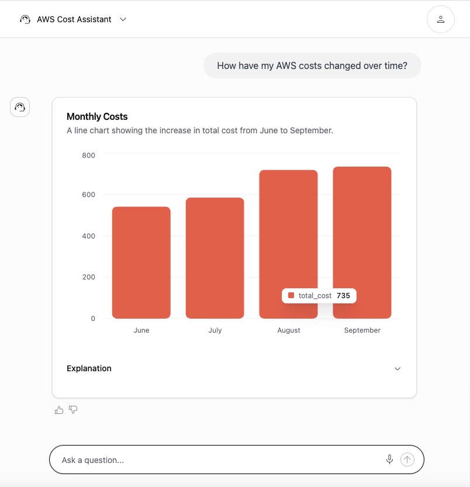

# Text to SQL (AWS Cost Calculator)

Another useful feature of Opsloom is its ability to generate SQL on the fly. By setting the assistant's type to *"sql"* and passing in the name of the desired table, you get access to a rich set of features that can translate text into SQL queries and generate charts from the results.

## What We'll Be Creating

During your initial setup, alembic created a dummy table with example data for this tutorial, *aws_cost.* This table lists out monthly costs for different AWS resources in a four-month period from June to September. We will create an assistant that can pull information from this table and render it in an actionable way.

First, the assistant will compare incoming questions against the structure of tables in the database to determine if it can answer with a SQL query. If so, it will run the query and visualize the results.

Our text-to-SQL tools can visualize results in two ways: bar charts and tables. If the assistant's generated SQL query returns both a categorical variable and a numeric variable, it will render the results as a bar chart; otherwise it will render the results as a table.

## Creating the Assistant

Open up the `assistant/create_assistant` endpoint and make the following changes to the JSON in the request body:

- Set `name` to *"openai_aws_cost."*
- Set `config/type` to *"sql."*
- In `config`, below `provider`, add the `table_name` field and set it to *"aws_cost."*
- Set `metadata/title` to *"AWS Cost Assistant."*
- Set `metadata/description` to *"Provides Insights and Analysis for Your AWS Usage."*
- Set `system_prompts/system` to the following:

> You are a data analyst with access to the AWS cost data for your organization. You are tasked with responding to all questions about AWS costs with appropriate charts. Be concise and grammatically correct.

- In `system_prompts`, below `system`, add a `data_description` field and set it to the following:

> The \`month\` column is a string, not a date, and should be treated as a categorical variable. Its possible values are \`June\`, \`July\`, \`August\`, or \`September\`.

- Set `system_prompts/prompts` to:
  - *"How have my AWS costs changed over time?"*
  - *"What are my most expensive AWS resources?"*
  - *"In the month of September, which resources went over budget?"*

## Using the Assistant
Refresh the frontend to see the new assistant in action. It should be able to understand your question, generate an appropriate SQL query, and render the results of the query in a bar chart.

For example, this is how the assistant will respond to *"How have my AWS costs changed over time?"*

The "Explanation" section can be toggled open to view additional context, including the underlying SQL query. As the assistant is supplied with tables spanning more columns, it will be capable of making more complex queries and answering more involved questions. Try supplying some of your own test data to see this in action.